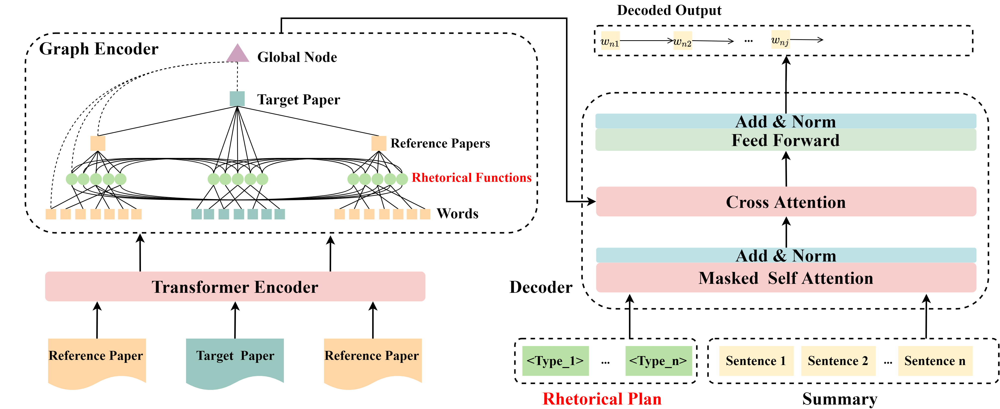

# What Can Rhetoric Bring Us? Incorporating Rhetorical Structure into Automatic Related Work Generation
This is the Pytorch implementation for our paper: What Can Rhetoric Bring Us? Incorporating Rhetorical Structure into Automatic Related Work Generation.

Submitted to Expert Systems with Applications.

<p align="center">
 
</p>

## Requirements
* Python == 3.6.3
* Pytorch == 1.5.0
* transformers == 4.10.3
* dgl-cu101 == 0.6.1
* pyrouge == 0.1.3
* nltk == 3.6.7
* scikit-learn == 0.24.2

## Usage
1. Create folder `trained_model`, `result` , `log` under the root directory.

2. Download Multi-Xscience Dataset from [here](https://github.com/yaolu/Multi-XScience), TAD and TAS2 Dataset from [here](https://github.com/iriscxy/Target-aware-RWG)

3. Download scibert from [here](https://huggingface.co/allenai/scibert_scivocab_uncased/tree/main) and place it under the Rhetorical_Function_Classification folder.

4. Train the sentence-level rhetorical classifier using

```bash
bash ./Rhetorical_Function_Classification/train.sh
```

5. Using the rhetorical classifier to label the rhetorical functions of Multi-Xscience, TAD,and TAS2 datasets. 

6. Train RSGen using
```bash
export PYTHONPATH=.

python train.py  --mode train --cuda  --data_dir <path-to-datasets-folder> --batch_size 2 --cls_batch_size 64 --seed 666 --train_steps 80000 --save_checkpoint_steps 4000  --report_every 1  --visible_gpus 0 --gpu_ranks 0  --world_size 1 --accum_count 2 --dec_dropout 0.1 --enc_dropout 0.1  --model_path  ./trained_model/model_name  --log_file ./log/train_source.txt  --inter_layers 6,7 --gat_heads 4 --inter_heads 8 --hier --doc_max_timesteps 50 --use_bert false --prop 6 --sep_optim false --num_workers 5 --warmup_steps 8000 --lr 0.005 --enc_layers 6  --dec_layers 6 --use_nucleus_sampling false --label_smoothing 0.1
```

7. Test with RSGen:
```bash
export PYTHONPATH=.

python train.py  --mode test --cuda  --data_dir <path-to-datasets-folder> --batch_size 8 --valid_batch_size 8 --seed 666   --visible_gpus 0 --gpu_ranks 0 --dec_dropout 0.1 --enc_dropout 0.1  --lr 0.2 --label_smoothing 0.0  --log_file <path-to-log-file>  --inter_layers 6,7 --inter_heads 8 --doc_max_timesteps 50 --use_bert false --report_rouge --alpha 0.4 --max_length 400 --result_path <path-to-result-folder> --prop 3 --test_all false --sep_optim false   --use_bert false  --use_nucleus_sampling false --min_length1 100 --min_length2 110 --no_repeat_ngram_size1 3 --no_repeat_ngram_size2 3 --test_from <path-to-saved-model-checkpoint>
```